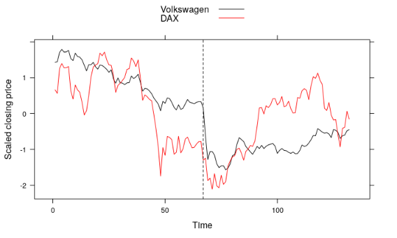
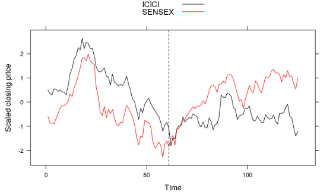
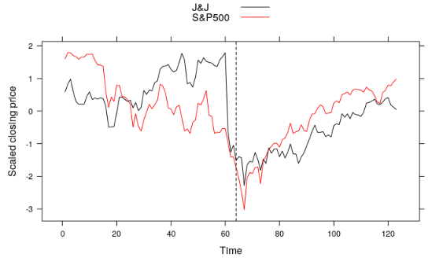
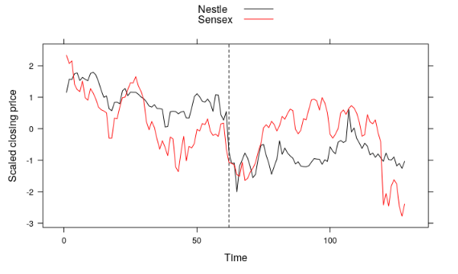
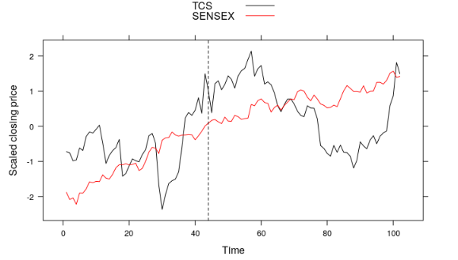

```{r setup, include=FALSE}
knitr::opts_chunk$set(echo = FALSE)
library(lattice)
library(quantmod)

options("getSymbols.warning4.0"=FALSE)
source("gui/es.R")
```

## Event Study

- Event study is measuring the impact of an economic event on the value of a
  firm.
- It supplements the portfolio manager's intuition about the effect of an event
    - Will a stock react to an event?
    - If it does, how long will the reaction last?
    - If it does not, what signal does it give us?
- We exclude macroeconomic or political events which may affect the entire 
  market.
- We are studying **rare events**
    
## Types of events   

- News of lapse in corporate governance.
- A significant law suit.
- Change in top leadership.
- Product recall.
- Mergers and acquisitions.
- Issue of new debt or equity.

## Interpretation of results

- Positive results can guide trading decisions depending on the portfolio
  manager's trading horizon.
- Time series study reveals evolution of the market.
- Cross-sectional study reveals the structure of the market.
- Negative results are also valuable.
    - Feeble impact of a law suit indicates an ineffective legal framework.
    - No response to a patent announcement suggests weak protection of IP.

## Example 1 - Expected impact


## Example 2 - Market had foreboding
 

## Example 3 - 4.14B punitive damages


## Example 4 - a delayed reaction


## Example 5 - market cheered new CEO


## Beyond visualization - 1

- The simplest measure of an event's impact is **buy-and-hold abnormal returns** $BHAR$.
    - If you buy and hold the security for $N$ days prior and post the event what
      would be your returns.
    - A change in $BHAR$ is a simple measure of the event's impact.
- Return of $BHAR$ to its pre-event level indicates a return to normalcy. 
- $BHAR$ can be used to estimate how long the impact will last.
    
## Beyond visualization - 2    

- Simple CAPM gives relation between stock returns $R_s$ and market returns $R_m$
$$
R_s = \alpha + \beta R_m.
$$
- We estimate $\alpha$ and $\beta$ in a 'period of calm' and use them in the
'event period'. 
- The estimates will be poor. The lack of fit measures the impact of the event.
- The actual returns during the period of event are called **abnormal returns**, $AR$.
- Abnormal returns cumulated over a time $t$ from the event are called 
  **cumulative abnormal returns** $CAR$.

## Next steps

- For each index (an economy) and each event type, generate statistics of event.
- Build an Analysis Of Variance model to ascertain if an event causes a change in
  statistics.
- Cluster companies based on their response to an event.
- Develop survival (actuarial) models to predict the impact of the events.
- Include additional features like - business cycle, market capitalization, 
  industry sector.
  
## Challenges

- Accuracy of time of event.
- Isolating the event from any other events of similar impact.
- 
